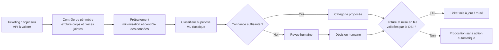

# Fiche de décision — <votre cas> (À COMPLÉTER)

**Client :** <nom, rôle> · **Groupe :** <prénoms> · **Cas <A/C/D>**

> **Livrable principal — 3-4 pages au maximum** (un plafond, pas une cible).
> Lisible par un architecte technique. Renommez en `dossier_conception.md`.
> Tout s'écrit **ici, une seule fois** : décisions, arbitrages, schéma et
> questions prévues. Tableaux plutôt que paragraphes.

---

## 1. Décisions de groupe (mardi 15h30-16h45)

> 3-5 points où vos cadrages M8-B1 divergeaient. Pas de compromis mou : un
> choix tranché et argumenté.

| Divergence | Positions (qui pensait quoi) | Décision retenue | Pourquoi |
| --- | --- | --- | --- |
| Contrainte DPO et données d’entrée | Théo  : seul l’objet peut être traité automatiquement ; l’exclusion du corps doit être garantie. Célia  : objet seul également, en supposant qu’il est préformaté et sans données sensibles. | Traiter uniquement l’objet, sans corps ni pièces jointes. Ne pas présumer que l’objet est préformaté ou exempt de données personnelles ; vérifier le périmètre de l’API et bloquer le pilote si cette séparation n’est pas démontrée. | La consigne DPO est explicite, tandis que le format et le contenu réel des objets restent à confirmer. Le risque de fuite de données de santé ou de NIR interdit de s’appuyer sur une simple hypothèse. |
| Qualité et représentativité des données | Théo  : extrait de 20 lignes non démontré représentatif, catégories historiques à auditer et volumes à réconcilier. Célia  : 10 000 tickets jugés de bonne qualité et objets supposés sans données personnelles, malgré des notes signalant des libellés incohérents. | Ne pas qualifier les 10 000 tickets de jeu fiable avant audit. Vérifier les libellés, la répartition temporelle et par catégorie, puis constituer un jeu de test représentatif et indépendant. | L’extrait ne contient que 20 tickets, sans aucune ligne « formation » ; `autre` a servi de fourre-tout et `materiel` y était auparavant rangé. Les quelque 80 tickets/jour annoncés doivent aussi être réconciliés avec les 10 000 tickets sur trois ans. |
| Indicateurs et seuils de réussite | Théo  : cible client de plus de 85 % de routage correct et passage d’environ 1 h à 10 min ; son cadrage ne reprend pas le plafond de revue manuelle. Célia  : reprend aussi le plafond client de 20 % de revue et propose un rappel paie de 90 % ; son cadrage mentionne également 15 min. | Nous retenons les seuils communiqués par le client : plus de 85 % de routage correct, au plus 20 % de tickets en revue manuelle et 10 min de tri quotidien. Nous mesurerons séparément le rappel paie ; le seuil de 90 % reste à valider. Les tickets de paie proches de la clôture seront revus par une personne. | Le client a fixé les seuils de routage, de revue manuelle et de temps de tri. La valeur de 15 min contredit sa cible de 10 min. Le rappel paie de 90 % est une proposition de Célia, pas un seuil validé par le client. |
| Circuit de routage | Théo : distingue lecture API, décision, écriture de catégorie et mise en file ; le déclenchement reste à confirmer avec la DSI. Célia : prévoit un routage automatique vers la boîte de l’équipe, sans détailler l’écriture de catégorie dans le ticketing. | Séparer la décision du modèle des actions dans le ticketing ; confirmer avec la DSI le déclenchement de l’écriture et de la mise en file avant le pilote. | Écriture et mise en file sont des effets distincts, dont le déclenchement n’est pas confirmé ; les activer sans validation pourrait modifier ou router des tickets à tort. |
| Justification économique | Théo  : demande de clarifier si l’heure de tri est cumulée pour les deux assistantes ou correspond à chacune. Célia  : estime une baisse de la charge de tri de 20 % à 6,25 % d’un ETP, avec 15 min de revue manuelle par jour. | Faire préciser au client si l’heure de tri est cumulée ou par personne. Calculer le gain annuel dans les deux scénarios et les présenter aux équipes RH avant de conclure sur la rentabilité. | L’entretien ne précise pas si l’heure concerne les deux assistantes ensemble ou chacune. Cette différence modifie fortement le temps libéré. Les deux estimations donneront au métier une base claire pour apprécier le gain et le budget annuel de 20 à 30 k€. |

## 2. Les 5 arbitrages

> Pour chacun : **choix + raisons (≥ 1 chiffrée) + condition de changement
> d'avis** — ou « non applicable » en une ligne justifiée (+ ce qui ferait se
> poser la question). Répondre « SLM » ou « RAG » sur un cas sans texte pour
> remplir la grille est un signal de tropisme.

| Arbitrage | Choix — ou « non applicable » | Raisons (≥ 1 chiffrée) | On changerait d'avis si… |
| --- | --- | --- | --- |
| ML classique vs deep learning | ML classique supervisé (par exemple TF-IDF avec régression logistique ou SVM). | À 80 tickets/jour × 22 jours ouvrés, le volume est de 1 760 prédictions/mois : un ML classique local coûte environ 0 € en calcul CPU et répond en moins de 10 ms. Il répond au besoin de classification sans génération ; les quelque 10 000 historiques restent à auditer et la cible métier est > 85 % de routage correct. | Si l’évaluation indépendante sur des données représentatives montre que le modèle classique n’atteint pas cette cible malgré des libellés et des exemples fiables, nous testerons un modèle de deep learning. |
| SLM vs LLM | Ni SLM ni LLM au premier pilote : commencer par un classifieur supervisé classique. | Pour le même scénario — 1 760 classifications d’objets courts par mois (80 × 22) — le LLM API revient à 1,76–17,60 €/mois (0,1–1 centime par requête ; environ 8,80 € à 0,5 centime). Le SLM self-host a un coût variable de l’ordre d’une fraction de centime par requête, auquel s’ajoute le GPU cloud fixe de 300–1 500 €/mois : ces composantes sont distinguées pour ne pas comparer un coût par appel à un coût d’infrastructure. Le ML classique local reste à ~0 € de calcul CPU et < 10 ms ; l’objet peut aussi contenir des données personnelles. | Si le classifieur classique est insuffisant, comparer un SLM hébergé dans un environnement maîtrisé à un LLM API, en vérifiant d’abord que chaque option satisfait les exigences de confidentialité. Évaluer pour les deux la qualité sur le même jeu de test, la latence et le coût total à 1 760 requêtes/mois : coût d’API d’un côté, hébergement, exploitation et maintenance du SLM de l’autre. Retenir le meilleur compromis, sans privilégier d’avance l’une des deux options. |
| RAG oui / non | Non : les catégories du ticketing et les exemples historiques suffisent au premier pilote ; aucune recherche documentaire n’est actuellement requise. | À 1 760 tickets/mois, aucun besoin de recherche dans des documents n’est identifié ; l’embedding self-host CPU coûterait environ 0 € par requête, mais ajouterait un composant à maintenir, estimé à 10-15 % du coût de build par an. Le bénéfice de recherche ne justifie donc pas cette charge sans besoin métier démontré. | Nous ajouterions du RAG si la classification devait s’appuyer sur des règles RH ou documents identifiés qui évoluent régulièrement, et si des tests démontraient que leur consultation améliore les résultats. |
| Agents oui / non | Non : privilégier un flux déterministe qui analyse l’objet, propose une catégorie avec un niveau de confiance et transmet les cas incertains à une personne. | À 1 760 tickets/mois, un appel LLM à 0,5 centime coûterait ~8,80 €/mois. Une chaîne de 2 appels coûterait environ 35 à 88 €/mois en appliquant la marge ×2-5 indiquée pour les agents. La latence typique de 5 à 60 s et la complexité sont superflues pour une décision unique ; le flux vise le plafond métier de 20 % de revue. | Nous réexaminerions ce choix si le processus exigeait plusieurs actions coordonnées ou outils et qu’un agent apportait un bénéfice mesurable, après validation par la DSI de toute écriture ou mise en file. |
| Zero-shot suffit ? | Non pour le routage en production. Le zero-shot peut servir de baseline de comparaison ; il faut auditer les historiques et évaluer une approche utilisant des exemples annotés. | Les 20 lignes disponibles ne représentent que 0,2 % des quelque 10 000 tickets historiques (20 ÷ 10 000) et ne couvrent pas « formation » : elles ne suffisent donc pas à valider le modèle. À 1 760 tickets/mois, le coût d’un LLM zero-shot resterait faible (1,76 à 17,60 €/mois), mais ne compenserait pas l’absence de preuve de qualité ; il faut mesurer > 85 % de routage correct et ≤ 20 % de revue manuelle. | Nous ne retiendrions le zero-shot en production que si un test représentatif et indépendant, couvrant toutes les catégories, démontre qu’il atteint ces deux seuils métier. |

## 3. Architecture finale et sobriété



Le système ne lit que l’objet du ticket ; l’API doit garantir l’exclusion du corps et des pièces jointes avant tout pilote. Un classifieur supervisé classique propose une catégorie et sa confiance ; les cas incertains, ainsi que les tickets de paie proches de la clôture, sont soumis à une personne. Le seuil de confiance sera calibré sur un jeu de test représentatif pour viser plus de 85 % de routage correct et au plus 20 % de revue manuelle. L’écriture de la catégorie et la mise en file restent désactivées tant que la DSI n’a pas validé leur déclenchement.

**Ce qu'on n'a PAS mis** : pas de SLM/LLM ni de service génératif, car une classification de l’objet ne justifie pas cette complexité et l’objet peut contenir des données personnelles ; pas de RAG ni de base vectorielle, car aucune recherche documentaire n’est requise ; pas d’agent, car un flux déterministe suffit et limite les actions imprévues. Pas d’écriture ou de routage automatique dans le ticketing avant validation de la DSI, afin d’éviter des modifications ou envois erronés. Le zero-shot n’est pas retenu pour la production : les 20 lignes disponibles, sans exemple « formation », ne permettent pas de démontrer la fiabilité.

## 4. Évaluation

Avant toute mise en service, auditer les libellés et la répartition des quelque 10 000 tickets historiques, puis faire annoter/corriger un échantillon représentatif par les équipes RH. Les 20 lignes déjà disponibles ne suffisent pas à l’évaluation, notamment parce qu’elles ne comprennent aucun ticket « formation ». Comparer le classifieur à deux baselines simples : la catégorie majoritaire et, si elles existent, les règles de routage actuelles.

Séparer les données par date : entraînement et réglage sur les tickets les plus anciens, test final tenu à l’écart sur une période plus récente. Éviter qu’un même ticket ou des doublons se retrouvent dans plusieurs lots ; vérifier que chaque catégorie, en particulier « formation » et « paie », est suffisamment représentée avant de tirer une conclusion. Ne pas ajuster le modèle sur le jeu de test.

Sur le test, mesurer le taux de routage correct (cible client : **plus de 85 %**), le taux de tickets envoyés en revue humaine (au plus **20 %**), ainsi que précision et rappel par catégorie, en portant une attention particulière au rappel « paie ». Mesurer également le temps quotidien de tri (cible : **10 min**) lors d’un essai en mode silencieux, où les propositions ne modifient pas les tickets. Examiner les erreurs avec les RH et ne lancer le pilote que si les seuils sont atteints sur un jeu représentatif ; les tickets de paie proches de la clôture restent soumis à une validation humaine.

## 5. Déploiement et monitoring (héritage M5 / M6)

Déployer le service dans un environnement maîtrisé par le client, derrière l’API du ticketing, après validation DSI du périmètre de données et des actions autorisées. Suivre le CI/CD de M5 : tests, validation en préproduction, artefact modèle versionné et déploiement contrôlé. Commencer en mode silencieux, sans écriture ni mise en file, puis activer progressivement le routage seulement après validation métier et DSI. En cas d’incident, désactiver l’intégration et revenir à la version précédente du modèle ; le tri manuel reste le mode de secours. Ne pas journaliser les objets en clair : conserver des métriques agrégées, versions et résultats nécessaires à l’audit.

| Question | Métrique | Seuil | Alerte vers |
| --- | --- | --- | --- |
| En vie ? | Disponibilité de l’API et taux d’erreurs sur une fenêtre de 15 min | Alerte si indisponibilité > 5 min ou erreurs > 1 % ; seuils opérationnels à valider avec la DSI | DSI / exploitation ; bascule en tri manuel si le service est indisponible |
| Prédit bien ? | Taux de routage correct (exactitude) et part envoyée en revue (précision), calculés sur les tickets dont la catégorie a été vérifiée | Alerte métier si routage correct ≤ 85 % ou revue manuelle > 20 % sur une période glissante ; ces valeurs sont les seuils client | Référent RH et responsable du modèle ; suspendre le routage automatique et revenir à la revue humaine |
| Données qui dérivent ? | PSI de la répartition des catégories prédites, comparée à la baseline de validation | Alerte si PSI > 0,2 ; seuil initial à confirmer après calcul du PSI sur les données historiques | Responsable du modèle et référent RH ; analyser les changements avant tout réentraînement |

Examiner les alertes et les erreurs chaque semaine pendant le pilote, puis mensuellement si les indicateurs restent stables. Réentraîner uniquement si une dérive est confirmée ou si les catégories changent, avec des exemples nouvellement vérifiés par les RH ; réévaluer sur un jeu temporel indépendant selon les critères du §4. Les RH valident la qualité métier et la DSI autorise le déploiement de la nouvelle version. Toute mise à jour repasse par les tests et le déploiement contrôlé M5 ; conserver la version précédente pour permettre le rollback.

## 6. Conformité et sécurité

Le tri reste possible sous la contrainte formulée par Nadia : seul l’objet est transmis au classifieur, depuis un environnement maîtrisé par le client ; corps et pièces jointes ne sont ni lus, ni copiés, ni journalisés. Avant le pilote, la DSI doit démontrer par configuration et tests que l’API n’expose que l’objet. Le DPO valide le périmètre, la finalité, la durée de conservation et la base légale RGPD (art. 6) ; si l’objet contient des données de santé ou un NIR, leur traitement doit faire l’objet d’une analyse spécifique (art. 9 et règles françaises applicables au NIR). Réduire les données au strict nécessaire et évaluer avec le DPO si une AIPD est requise. Le risque résiduel est que l’objet lui-même contienne une donnée personnelle ou sensible : si cette exposition n’est pas maîtrisée et autorisée, ne pas lancer le pilote.

Au titre de l’AI Act, la qualification doit être confirmée par le responsable conformité selon la finalité et les effets réels du tri. Une catégorisation administrative sans effet sur l’emploi, l’évaluation, l’affectation ou les droits des salariés peut relever d’un risque différent d’un système utilisé pour prendre ou influencer ces décisions ; le seul contexte RH ne suffit pas à trancher. Documenter cette analyse avant le pilote et la reprendre si l’usage évolue.

| Menace | Mesure d’architecture | Risque résiduel |
| --- | --- | --- |
| Lecture ou export accidentel du corps / des pièces jointes | API en liste blanche limitée au champ objet ; compte de service en moindre privilège ; tests d’intégration négatifs ; blocage du pilote si l’exclusion n’est pas prouvée | Erreur de configuration ou évolution de l’API ; contrôles à chaque changement |
| Données personnelles ou sensibles dans l’objet | Analyse de l’objet par le DPO, minimisation/pseudonymisation si compatible avec le tri, accès restreint et conservation minimale ; aucun objet en clair dans les journaux | L’objet peut révéler une donnée sensible malgré les contrôles ; les cas détectés ou ambigus sont revus et le périmètre réévalué |
| Accès non autorisé ou modification/routage erroné | Secrets protégés, chiffrement en transit et au repos, permissions minimales ; écriture et mise en file désactivées jusqu’à validation DSI ; versionnement, audit des actions et retour au tri manuel | Compromission de compte ou erreur de routage ; détection, révocation des accès et rollback nécessaires |

## 7. Coûts (ordres de grandeur, sur VOTRE volumétrie)

Base de calcul : **80 tickets/jour × 22 jours ouvrés = 1 760 tickets/mois**. Montants indicatifs de la fiche de chiffrage, à confirmer par devis ; l’estimation de charge ci-dessous reste à affiner après validation du périmètre API et du volume d’annotation.

| Poste | Estimation | Hypothèse |
| --- | --- | --- |
| Inférence retenue : classifieur ML classique local | ~0 € de calcul CPU/mois ; < 10 ms par ticket | 1 760 classifications/mois ; suppose une capacité CPU existante. Si un serveur dédié est nécessaire : 10–100 €/mois (120–1 200 €/an). |
| Mise en place du scénario de référence : audit des données, classifieur, évaluation, intégration API et déploiement pilote | **15–25 j.h**, soit environ **6 000–22 500 €** à 400–900 €/j.h | Ordre de grandeur pour un modèle ML classique et une API existante, avec échantillon représentatif audité/annoté, tests de sécurité et mode silencieux. Inclut environ 3–5 j.h d’audit/préparation des données, 4–6 j.h de modélisation/évaluation, 4–7 j.h d’intégration, 3–5 j.h de tests/déploiement et 1–2 j.h de coordination. À réviser si l’API doit être modifiée, si l’annotation dépasse l’échantillon ou si les libellés nécessitent une remise en qualité importante. |
| Maintenance | 10–15 % du coût de build par an | Ordre de grandeur par composant supplémentaire ; le build doit être estimé avant de calculer le montant annuel. |
| Comparateur non retenu : LLM API | 1,76–17,60 €/mois (21,12–211,20 €/an) ; environ 8,80 €/mois au tarif indicatif de 0,5 centime/appel | Même volume de 1 760 objets courts/mois, à 0,1–1 centime par requête. À évaluer seulement si le modèle classique est insuffisant et si les exigences de confidentialité sont satisfaites. |
| Comparateur non retenu : SLM hébergé | GPU cloud : 300–1 500 €/mois (3 600–18 000 €/an), plus coût variable d’une fraction de centime par requête | Même volume ; le coût fixe d’hébergement domine ici le coût par appel. Comparer au LLM API en coût total et selon l’exigence d’hébergement maîtrisé. |
| Temps métier / gain potentiel | Cible de tri : passer d’environ 1 h à 10 min/jour, soit jusqu’à 50 min/jour libérées ; revue manuelle plafonnée à 20 % (jusqu’à 16 tickets/jour) | Gain à mesurer en pilote. Clarifier si l’heure actuelle est cumulée pour les deux assistantes ou par personne ; le budget annuel client de 20–30 k€ n’est pas assimilable au coût technique ni une preuve de rentabilité. |

Le scénario de référence reste le classifieur classique, sans coût d’API ni GPU dédié si l’infrastructure CPU existante suffit. Avant décision budgétaire, confirmer l’estimation de 15–25 j.h, le besoin d’hébergement et la charge de revue, puis comparer le coût total annuel au budget client de 20–30 k€.

---

## ⭐ Optionnel — Pseudo-code du composant critique

```text
fonction <nom>(<entrées>):
    # 10-20 lignes : cas nominal, cas limite (donnée manquante, confiance basse…),
    # ce qui est journalisé.
```

## Annexe — 5 questions prévues (hors pagination)

| # | Question probable | Réponse préparée (2-3 lignes) | Qui répond |
| --- | --- | --- | --- |
| 1 |  |  |  |
| 2 |  |  |  |
| 3 |  |  |  |
| 4 |  |  |  |
| 5 |  |  |  |
