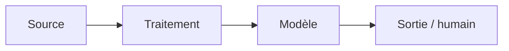

# Fiche de décision — <votre cas> (À COMPLÉTER)

**Client :** <nom, rôle> · **Groupe :** <prénoms> · **Cas <A/C/D>**

> **Livrable principal — 3-4 pages au maximum** (un plafond, pas une cible).
> Lisible par un architecte technique. Renommez en `dossier_conception.md`.
> Tout s'écrit **ici, une seule fois** : décisions, arbitrages, schéma et
> questions prévues. Tableaux plutôt que paragraphes.

---

## 1. Décisions de groupe (mardi 15h30-16h45)

> 3-5 points où vos cadrages M8-B1 divergeaient. Pas de compromis mou : un
> choix tranché et argumenté.

| Divergence | Positions (qui pensait quoi) | Décision retenue | Pourquoi |
| --- | --- | --- | --- |
| Contrainte DPO et données d’entrée | Théo  : seul l’objet peut être traité automatiquement ; l’exclusion du corps doit être garantie. Célia  : objet seul également, en supposant qu’il est préformaté et sans données sensibles. | Traiter uniquement l’objet, sans corps ni pièces jointes. Ne pas présumer que l’objet est préformaté ou exempt de données personnelles ; vérifier le périmètre de l’API et bloquer le pilote si cette séparation n’est pas démontrée. | La consigne DPO est explicite, tandis que le format et le contenu réel des objets restent à confirmer. Le risque de fuite de données de santé ou de NIR interdit de s’appuyer sur une simple hypothèse. |
| Qualité et représentativité des données | Théo  : extrait de 20 lignes non démontré représentatif, catégories historiques à auditer et volumes à réconcilier. Célia  : 10 000 tickets jugés de bonne qualité et objets supposés sans données personnelles, malgré des notes signalant des libellés incohérents. | Ne pas qualifier les 10 000 tickets de jeu fiable avant audit. Vérifier les libellés, la répartition temporelle et par catégorie, puis constituer un jeu de test représentatif et indépendant. | L’extrait ne contient que 20 tickets, sans aucune ligne « formation » ; `autre` a servi de fourre-tout et `materiel` y était auparavant rangé. Les quelque 80 tickets/jour annoncés doivent aussi être réconciliés avec les 10 000 tickets sur trois ans. |
| Indicateurs et seuils de réussite | Théo  : cible client de plus de 85 % de routage correct et passage d’environ 1 h à 10 min ; son cadrage ne reprend pas le plafond de revue manuelle. Célia  : reprend aussi le plafond client de 20 % de revue et propose un rappel paie de 90 % ; son cadrage mentionne également 15 min. | Nous retenons les seuils communiqués par le client : plus de 85 % de routage correct, au plus 20 % de tickets en revue manuelle et 10 min de tri quotidien. Nous mesurerons séparément le rappel paie ; le seuil de 90 % reste à valider. Les tickets de paie proches de la clôture seront revus par une personne. | Le client a fixé les seuils de routage, de revue manuelle et de temps de tri. La valeur de 15 min contredit sa cible de 10 min. Le rappel paie de 90 % est une proposition de Célia, pas un seuil validé par le client. |
| Circuit de routage | Théo : distingue lecture API, décision, écriture de catégorie et mise en file ; le déclenchement reste à confirmer avec la DSI. Célia : prévoit un routage automatique vers la boîte de l’équipe, sans détailler l’écriture de catégorie dans le ticketing. | Séparer la décision du modèle des actions dans le ticketing ; confirmer avec la DSI le déclenchement de l’écriture et de la mise en file avant le pilote. | Écriture et mise en file sont des effets distincts, dont le déclenchement n’est pas confirmé ; les activer sans validation pourrait modifier ou router des tickets à tort. |
| Justification économique | Théo  : demande de clarifier si l’heure de tri est cumulée pour les deux assistantes ou correspond à chacune. Célia  : estime une baisse de la charge de tri de 20 % à 6,25 % d’un ETP, avec 15 min de revue manuelle par jour. | Faire préciser au client si l’heure de tri est cumulée ou par personne. Calculer le gain annuel dans les deux scénarios et les présenter aux équipes RH avant de conclure sur la rentabilité. | L’entretien ne précise pas si l’heure concerne les deux assistantes ensemble ou chacune. Cette différence modifie fortement le temps libéré. Les deux estimations donneront au métier une base claire pour apprécier le gain et le budget annuel de 20 à 30 k€. |

## 2. Les 5 arbitrages

> Pour chacun : **choix + raisons (≥ 1 chiffrée) + condition de changement
> d'avis** — ou « non applicable » en une ligne justifiée (+ ce qui ferait se
> poser la question). Répondre « SLM » ou « RAG » sur un cas sans texte pour
> remplir la grille est un signal de tropisme.

| Arbitrage | Choix — ou « non applicable » | Raisons (≥ 1 chiffrée) | On changerait d'avis si… |
| --- | --- | --- | --- |
| ML classique vs deep learning |  |  |  |
| SLM vs LLM |  |  |  |
| RAG oui / non |  |  |  |
| Agents oui / non |  |  |  |
| Zero-shot suffit ? |  |  |  |

## 3. Architecture finale et sobriété



<!-- Chaque brique découle d'un arbitrage. Commentez en 3-4 lignes. -->

**Ce qu'on n'a PAS mis (obligatoire)** : <!-- brique écartée + raison, ex. « pas de vector DB : RAG = non » -->

## 4. Évaluation

<!-- Comment on saura que ça marche AVANT la mise en service :
     baseline simple à battre, découpage des données (temporel si le temps compte),
     métriques alignées sur le KPI métier du cadrage. -->

## 5. Déploiement et monitoring (héritage M5 / M6)

<!-- Où et comment ça tourne, rollback. Puis : -->

| Question | Métrique | Seuil | Alerte vers |
| --- | --- | --- | --- |
| En vie ? |  |  |  |
| Prédit bien ? |  |  |  |
| Données qui dérivent ? |  |  |  |

<!-- Quand réentraîner, et qui décide. -->

## 6. Conformité et sécurité

<!-- Qualification AI Act et base légale RGPD reprises des cadrages (raisonnement,
     pas étiquette), en tenant compte de l'imprévu client de mardi 14h30.
     Chaque menace de sécurité retenue → sa réponse d'architecture + le risque résiduel. -->

## 7. Coûts (ordres de grandeur, sur VOTRE volumétrie)

<!-- ressources/fiche_chiffrage.md — à recalculer, pas à recopier. -->

| Poste | Estimation | Hypothèse |
| --- | --- | --- |
|  |  |  |

---

## ⭐ Optionnel — Pseudo-code du composant critique

```text
fonction <nom>(<entrées>):
    # 10-20 lignes : cas nominal, cas limite (donnée manquante, confiance basse…),
    # ce qui est journalisé.
```

## Annexe — 5 questions prévues (hors pagination)

| # | Question probable | Réponse préparée (2-3 lignes) | Qui répond |
| --- | --- | --- | --- |
| 1 |  |  |  |
| 2 |  |  |  |
| 3 |  |  |  |
| 4 |  |  |  |
| 5 |  |  |  |
